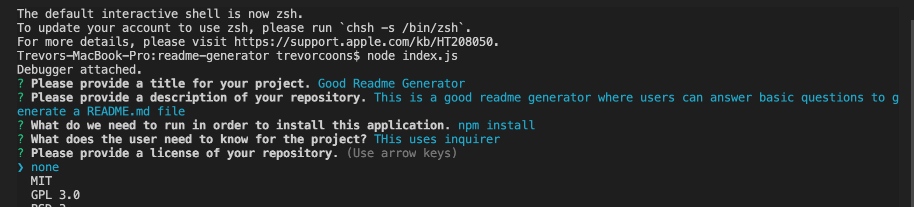

# Good README Generator

This is a readme.md generator that allows users to answer simple questions using inquirer to generate a readme file for their projects.

## Built With

* [Inquirer]()
* [JavaScript](https://developer.mozilla.org/en-US/docs/Web/JavaScript)

## Authors

* **Trevor Coons** 

- [Link to Portfolio Site](https://trevcoons.github.io/trevors-portfolio/)
- [Link to Github](https://github.com/trevcoons)
- [Link to LinkedIn](www.linkedin.com/in/trevor-coons-2a948a104)

## Acknowledgments

Thanks to UC Berkeley Coding Bootcamp for teaching me HTML, JavaScript, JQuery, and BootStrap.

